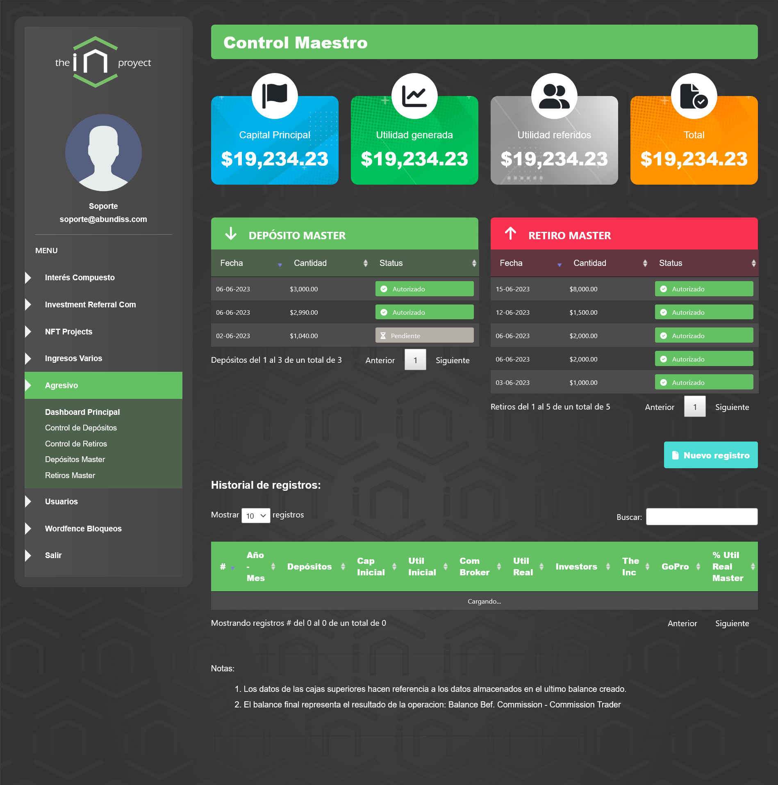
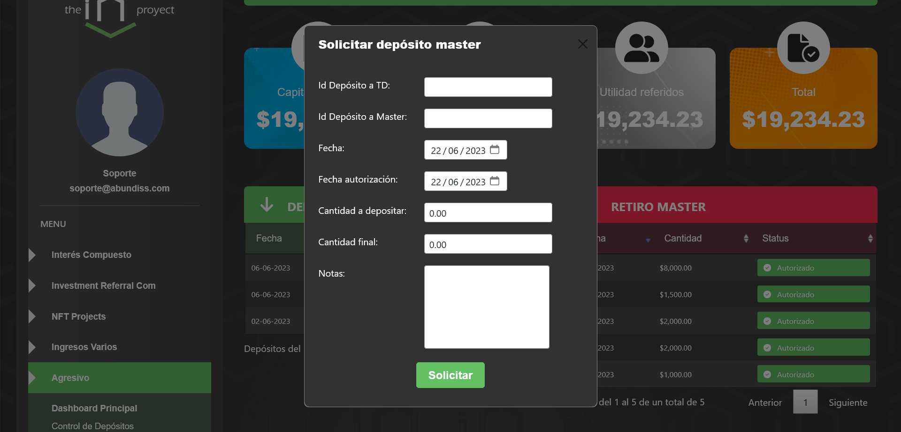
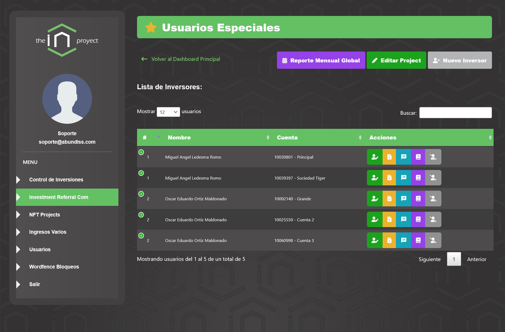
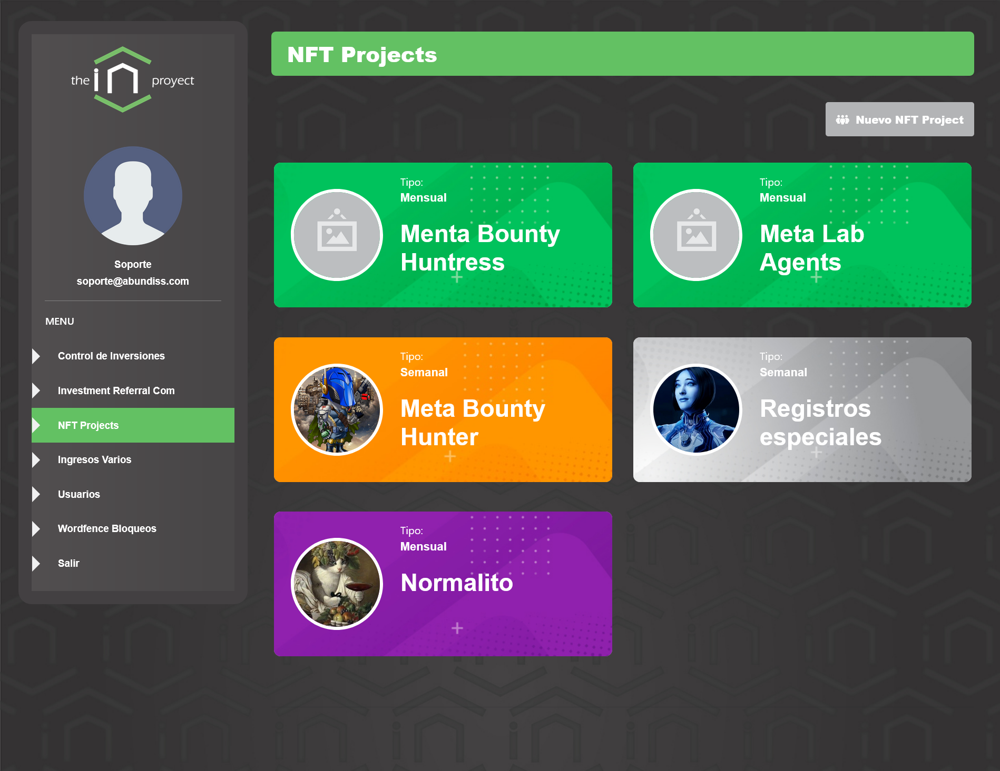
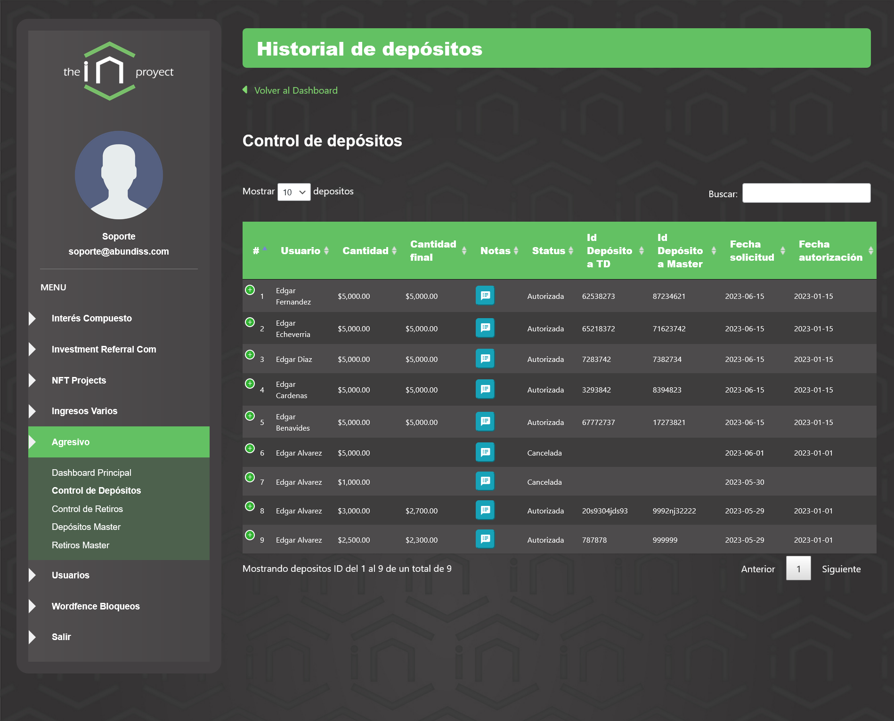
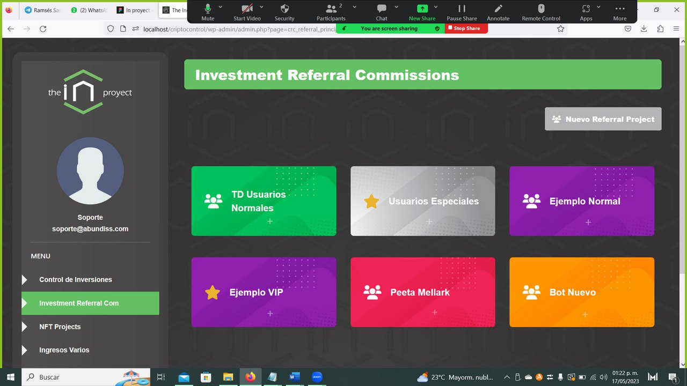

# Plugin Gestión de Inversiones

## 📌 Descripción

**Plugin Gestión de Inversiones** es un plugin desarrollado completamente desde cero para WordPress que transforma un sitio web tradicional en un sistema avanzado de gestión y control de cuentas individuales de usuarios con múltiples proyectos de inversión.

Convierte WordPress en una plataforma personalizada tipo dashboard financiero, manteniendo todas las ventajas del ecosistema WordPress mientras agrega una capa robusta de administración y control de inversiones.

---

## 🚀 Características Principales

- 🔐 Sistema de cuentas individuales por usuario
- 📊 Gestión de múltiples proyectos de inversión por cuenta
- 🧾 Registro y control detallado de operaciones
- 📈 Visualización estructurada de información financiera
- 🎨 Interfaz moderna, limpia y profesional
- 📱 Diseño 100% responsivo
- ⚡ Alto rendimiento y código optimizado
- 🛡 Control de accesos a modulos por usuario
- 🧩 Compatible con la arquitectura nativa de WordPress
- 🛠 Fácil mantenimiento y escalabilidad

---

## 🧠 Arquitectura y Desarrollo

Este plugin fue desarrollado:

- Desde cero (sin frameworks externos)
- Siguiendo estándares de desarrollo WordPress
- Con enfoque en:
  - Seguridad
  - Escalabilidad
  - Mantenibilidad
  - Buenas prácticas de código

El plugin implementa un modelo híbrido:

- 📄 Custom Post Types → Gestión estructurada de entidades visibles y configurables.
- 🗄 Custom Database Tables → Manejo eficiente de datos financieros y relaciones complejas.
- 🔌 Uso extensivo de Hooks (Actions & Filters).
- 🔐 Sistema de control de roles y capacidades personalizado.
- 🧩 Integración limpia con el core de WordPress.

Este enfoque permite separar:

- Lógica de negocio
- Persistencia de datos
- Presentación
- Control de acceso
---

## 🎛 Panel Administrativo

El sistema incorpora dashboards personalizados en el área de administración de WordPress que permiten:

- Visualización centralizada de cuentas
- Gestión de proyectos de inversión
- Administración de usuarios
- Control estructurado de datos financieros
- Monitoreo interno del sistema

El diseño está orientado a:

- Claridad visual
- Navegación intuitiva
- Escalabilidad futura
- Experiencia profesional tipo plataforma financiera

---

## 🎨 Experiencia de Usuario

Aunque el enfoque principal es administrativo (SaaS interno), el plugin:

- Mantiene completamente las capacidades tradicionales de WordPress
- No interfiere con el funcionamiento del frontend
- Conserva compatibilidad con temas y otros plugins
- Respeta la arquitectura del Core

---

## 🔒 Seguridad

Se implementaron buenas prácticas de seguridad:

- Validación y sanitización estricta de inputs
- Uso correcto de Nonces
- Control granular de capacidades
- Consultas preparadas a base de datos
- Protección contra accesos no autorizados

---

## 🧠 Diseño y Principios de Desarrollo

El desarrollo se basó en:

- Clean Code
- Separación de responsabilidades
- Estructura modular
- Escalabilidad progresiva
- Bajo acoplamiento
- Alta mantenibilidad

---

## 🧰 Stack Tecnológico

- PHP 8+
- WordPress Core APIs
- MySQL / MariaDB
- HTML5
- CSS3
- JavaScript
- Arquitectura basada en Hooks

---

## 📦 Demo parcial online

Link de demo: https://gestionclientes.miktlansoft.com/
Usuario: andresh 
Pass: DemoGestion49@
Videos demo: https://drive.google.com/drive/folders/1GcZBnbpQoFqQrYYQoDUgDDKUgaYvY7fy?usp=drive_link

## 📸 Interface Preview

### Investment Admin Detail Panel

---

### Admin Accounts List

---

### Full Report

---

### NFT Accocunts Panel

---

### Users Control Panel

---

### Home Panel

## 👨‍💻 Author

Uriel Plata  
Senior WordPress Developer, Software Engineer & AI Master  
Systems Architecture & Backend Engineering
